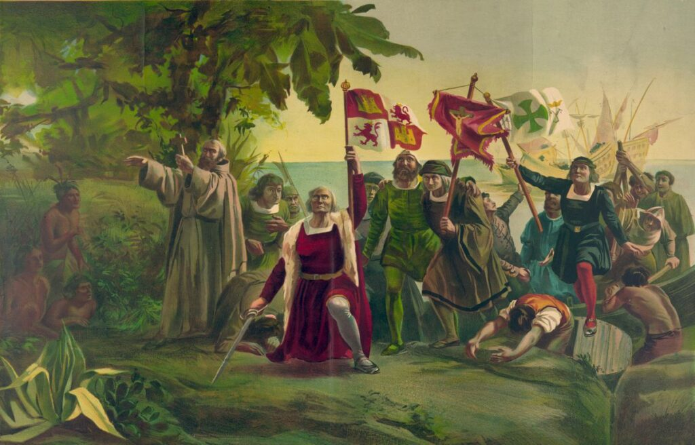
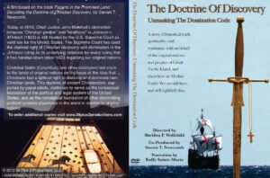

[The American Indian Law Alliance (AILA)](/) is committed to confronting and combating the [Doctrine of Discovery](https://doctrineofdiscovery.org) and the ways in which it is preserved in international law and used by settler colonial states to justify and excuse their violence.

## **Doctrine of Discovery**

Papal Bulls issues in the 15th century provided Christian explorers the imagined right to assert that the lands they "discovered"  were now under the authority of the Christian Monarchs of Europe. The Papal Bulls asserted that any land that was not inhabited by Christians was available to be "discovered", claimed, and exploited. If the "pagan" or “saracen” inhabitants could be converted, they might be spared. If not, they could be enslaved or killed. The legacy and horror of these Papal Bulls is still impacting Indigenous nations and peoples today. 

\[caption id="attachment\_10755" align="aligncenter" width="1024"\] A painting by Dioscoro Puebla, Christopher Columbus is shown arriving in the New World — the West Indies — on Oct. 12, 1492. (Wikimedia Commons)\[/caption\]

With a flag and on bended knee these evil acts were sanctified and made them lawful in the eyes of the churches and crowns of Europe. The notions that all parts of the globe that weren't Europe like the African Continent and Turtle Island/Abya Yala was “discovered” and “terra nullius” \[null and void\] are theological and legal fictions which are still exercised as law today and weaponized against Indigenous nations and peoples denying them land, rights, and resources.

The [United States Supreme Court in 2005](https://doctrineofdiscovery.org/sherrill-v-oneida-opinion-of-the-court/), relying on a series of Indian law cases going back to 1823, specifically cited the Doctrine in its decision denying the right of the Oneida Indian Nation of New York to regain its territory. Justice Ruth Bader Ginsburg wrote in the 2005 decision. "Under the Doctrine of Discovery ... fee title to the land occupied by Indians when the colonists arrived became vested in the sovereign - first the discovering European nation and later the original States and the United States.”

In fact, [the Doctrine of Discovery](https://doctrineofdiscovery.org/) is the basis for all Indian land law in the United States and Canada, and it has imposed similar burdens on indigenous peoples all over the world – Australia, New Zealand, in Africa, in Latin America and in the island nations of the Caribbean and Oceania. 

Presently more than 500 million Indigenous peoples around the globe live today with the effects of the Doctrine's oppressive racism.

\[su\_button url="https://aila.ngo/wp-content/uploads/2022/05/Doctrine-of-Discovery-Booklet-rev3.1.pdf" target="blank" background="#000" size="6" center="yes" icon="icon: download" download="Doctrine of Discovery Booklet PDF Download"\]Download an educational booklet (PDF)\[/su\_button\]

### [➞ Learn more about the Doctrine of Discovery at doctrineofdiscovery.org](https://doctrineofdiscovery.org/)

### **Origins of the Transatlantic Slave Trade**

The Doctrine of Discovery as the basis for land theft and the genocide of Indigenous peoples is well known in international legal circles, what is perhaps less well known is that it is also the origins of the [Transatlantic slave trade](https://doctrineofdiscovery.org/dum-diversas/).

After the church and crown were bankrupt from the crusades and from killing their own Indigenous peoples. They turned their attention to the colonizing and committing genocide against the Indigenous nations and peoples of the African continent. The church and crowns greed and lust for blood and gold unsatisfied they turn to looking for new lands to dominate and new peoples to dehumanize.

In this process 12 million enslaved Africans were brought to Turtle Island (David Stannard, _American Holocaust_). Europeans Christians saw Indigenous Africans as a expendable and exploitable commodity and the 12 million Indigenous peoples of Turtle Island as terranullus. Therefore the genocides Indigenous peoples of Turtle Island was no different than clearing the land for extraction.

 

### **The Doctrine of Discovery and the Sullivan Clinton Campaign**

Part of the Haudenosaunee and Onondaga lived history of the Doctrine of Discovery is the [Sullivan Clinton Campaign](https://sullivanclinton.com).

The campaign was ordered and organized by George Washington and his staff believed it was necessary to destroy the Haudenosaunee Confederacy and violate the treaties in order to expand the colonies and pay colonial troops. The Sullivan Clinton campaign was conducted in the lands of the Haudenosaunee Confederacy. 

> ‘taking the war home to the enemy to break their morale…’ But you will not by any means listen to any overture of peace before the total ruinment of their settlements is effected. Our future security will be in their inability to injure us and in the terror with which the severity of the chastisement they receive will inspire them.” ([Letter from George Washington to John Sullivan](https://founders.archives.gov/documents/Washington/03-20-02-0661))

- More than 40 Onondaga villages and stores of winter crops were burned and destroyed. 
- Every president to this day is known as [Hanadagá:yas](https://www.onondaganation.org/history/us-presidents-hanadagayas/)

### [➞ Learn more about the Sullivan Clinton Campaign](https://www.sullivanclinton.com/)

* * *

### **The United Nations Preliminary Study on the Doctrine of Discovery**

 

_The Written Preliminary Study Shows_ [_‘Doctrine of Discovery’ Legal Construct_](/wp-content/uploads/2010/09/DOD5.pdf) _Historical Root for Ongoing Violations of Indigenous Peoples’ Rights, Permanent Forum Told_

_Prepared and presented by Tonya Gonnella Frichner North American Regional Special Rapporteur  April 27, 2010_

The "Preliminary study on the impact on indigenous peoples of the international legal construct known as the Doctrine of Discovery" (E/C.19/2010/13) presented at the Ninth Session authored by Tonya Gonnella Frichner, Esq. (Onondaga Nation), former North American Representative to the UN Permanent Forum on Indigenous Issues. We recognize the legal construct known as the [Doctrine of Discovery](/issues/doctrine-of-discovery/) has global implications. As established in the preliminary study and reaffirmed in the more recent study, as mentioned above, the Doctrine of Discovery has been invoked as a justification for the ongoing exploitation of our lands, territories and resources which violates [UNDRIP Article 7](https://web.archive.org/web/20241126141121/https://www.un.org/development/desa/indigenouspeoples/wp-content/uploads/sites/19/2018/11/UNDRIP_E_web.pdf), the collective right to live in freedom and shall not be subjected to any act of genocide or violence including forcibly removing children of the group to another group. 

\[su\_button url="https://aila.ngo/wp-content/uploads/2010/09/DOD5.pdf" target="blank" background="#000" size="6" center="yes" icon="icon: download" download="Preliminary Report PDF Download"\] Read the Preliminary Report (PDF)\[/su\_button\]

 

The installation of the Carlisle Indian Industrial School in Pennsylvania was a US government initiative focused on “Killing the Indian to save the man” a theory and practice advanced by Brigadier General Richard Henry Pratt to exterminate over 12 million Indigenous peoples. 

The American Indian Law Alliance (AILA) recognizes the Doctrine of Discovery and its long-term effects on the Haudenosaunee Confederacy and all Indigenous peoples led to the atrocities Indigenous peoples faced in residential and boarding schools, both in Canada and the U.S. We note the insufficiencies and shortcomings of the Truth and Reconciliation Commission of Canada. We take note of the apologies extended to Indigenous Peoples by Australia, Canada and New Zealand regarding their implementation of boarding schools. In light of these things AILA will continue to push calls for a study on boarding schools for Indigenous children in the United States. These children suffered the same injustices, violations and persecutions and deserve apologies and reparations.  

Despite these violations of Indigenous nations' individual and collective human rights, Indigenous nations maintain the right to self-determination and applying the principle of free, prior and informed consent over our lands, territories and resources as affirmed under the [UNDRIP](https://web.archive.org/web/20241126141121/https://www.un.org/development/desa/indigenouspeoples/wp-content/uploads/sites/19/2018/11/UNDRIP_E_web.pdf). We call upon [article 27](https://web.archive.org/web/20241126141121/https://www.un.org/development/desa/indigenouspeoples/wp-content/uploads/sites/19/2018/11/UNDRIP_E_web.pdf) to be enforced for our rightful adjudication of our lands.

### Current Work on the Doctrine of Discovery

- Maintaining an educational resource on the [Doctrine of Discovery](https://doctrineofdiscovery.org).

### Learn More about the Doctrine of Discovery

[Watch Domination Code](https://vimeo.com/ondemand/dominationcode).

#### Open Access articles

- Brett, Adam D. J., and Betty Hill. 2026. “ Examining the Doctrine of Discovery in Religion and Indigenous Studies,” _Religion Compass_: e70039. [https://doi.org/10.1111/rec3.70039](https://doi.org/10.1111/rec3.70039).
- Brett, Adam DJ, and Betty Hill (Lyons). 2024. “Documenting Domination- From the Doctrine of Christian Discovery to Dominion Theology” _Religions_ 15, no. 12: 1493 (Special Issue Race, Religion, and Nationalism in the 21st Century). [https://doi.org/10.3390/rel15121493](https://doi.org/10.3390/rel15121493).
- Brett, Adam DJ, and Betty Hill (Lyons). 2024. “On the Limits of the Concept of Religious Freedom in Indigenous Communities”. _Journal of the Council for Research on Religion_ 5 (2). Montreal, QC, Canada: 75-96. [https://doi.org/10.26443/jcreor.v5i2.117](https://doi.org/10.26443/jcreor.v5i2.117).
- Indigenous Values Initiative, and American Indian Law Alliance. 2024. “Indigenous Values Initiative Together With the American Indian Law Alliance Submits This Report: The Territorial Integrity of Mother Earth, Indigenous Peoples, and the Right to Freedom of Religion or Belief”. _Journal of the Council for Research on Religion_ 5 (2). Montreal, QC, Canada: 40-45. [dofd.fyi/report/](https://dofd.fyi/report/)
