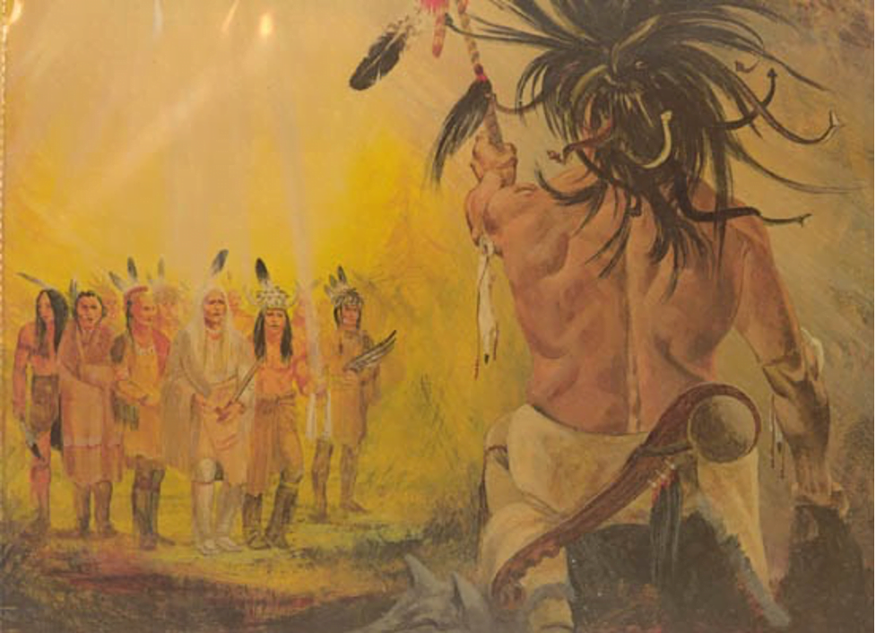
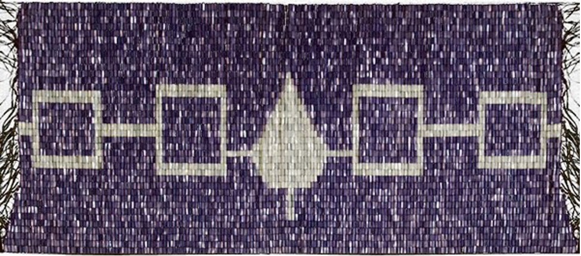

### [Birth of Democracy and the Birth of a Nation](https://www.onondaganation.org/)

\[caption id="attachment\_10768" align="aligncenter" width="441"\] Great Tree of Peace by Oren Lyons\[/caption\]

 

Over a thousand years ago on the shores of Onondaga Lake, in present day central New York, democracy was born.

The Mohawk, Oneida, Onondaga, Cayuga and Seneca people had been warring against each other. There was great bloodshed and death surrounding us. These people of the five nations had forgotten their ways and their actions saddened the Creator. The Creator decided to send a messenger to the people so that the five nations could live in peace. The messenger is referred to as the Peacemaker.

The Peacemaker was born on the northern shores of Lake Ontario.  There he was raised by his mother and grandmother.  Right away, they knew that this young person was special.  He always talked of peace and that he was given a powerful message by the Creator.

When he was ready, the Peacemaker told his mother and grandmother that he was off to bring peace to the warring people.  To travel there, the Peacemaker carved a canoe made entirely out of white stone! This amazing canoe would help convince the people of the powerful message of peace the Creator was sending to the five nations.  He said his goodbyes, and then started his journey across the big lake in the stone white canoe.

In order for the Creator’s message to spread, the Peacemaker sought out the most evil leaders of the people of the five nations. In searching for these people, the Peacemaker came upon a woman. This woman had no alliances but did provide shelter and food and promoted the continuation of the fighting between us. The Peacemaker told her about the message of peace and that her actions were promoting war and saddening the Creator.

After listening to the Peacemaker’s message, she agreed to follow the message. She was the first to accept the great peace and change her ways.  Because of this, the Peacemaker set aside a special duty for the women of the five nations.  They will have the duty of Clan Mother.  The Clan Mother will watch over the members of her clan and counsel them in a peaceful way. The Clan Mother will also have the important duty of selecting the next leader of their clan to keep the great peace continuing on.

The Peacemaker started with the eastern most nation, the Mohawks. In order for his plan to succeed, the Peacemaker sought after the most feared leaders. Peacemaker explained that he carried the Creator’s plan of peace.  That one nation can be easily broken, like a single arrow.  But five arrows bound together with one heart, one mind, and one law will be powerful.  The Mohawks liked his plan but were weary of a trap, so they tested the Peacemaker.  Once the Peacemaker passed their test over a large waterfall, the Mohawks were the first Nation to accept the peace.

\[caption id="attachment\_10769" align="aligncenter" width="977"\] Tadodaho by Oren Lyons\[/caption\]

 

The Peacemaker continued traveling west, seeking out the most evil and dangerous men.  As the Peacemaker told of the arrows, of all of the nations living symbolically in a large longhouse stretching across the land; the peace began to grow.

But one of the most feared men of the five nations was an Onondaga man named Tadodaho. Tadodaho was said to be so evil that his body was twisted and snakes grew from his head. Tadodaho defied all talks of peace.  When one man, Hiawatha talked of peace and the end of war, Tadodaho killed his family.  Grief stricken, Hiawatha no longer thought of peace  until one day when he came upon a lake.  As he came upon the lake, he found white and purple clam shells.  When stringing these together, Hiawatha was able to have peace.  He then joined with the Peacemaker and together they continued to spread the word of the peace to the other nations.

Once all four nations agreed to join in the peace, all that remained was the Onondaga.  Peacemaker, Hiawatha, and the leaders from the other Nations were ready to confront Tadodaho again. Tadodaho tried his sorcerous ways to stop them as they traveled across Onondaga Lake. 

But the message of peace was unstoppable.

The Peacemaker then offered to Tadodaho a very special duty in this plan of peace.  Tadodaho would preside over the Grand Council of 50 chiefs.  That he would have the responsibility to make sure that decisions were made with a good mind and were aligned not only for today, but for the generations not yet born.   It is at this time when Tadodaho agreed to live in a peaceful way as they “combed the snakes” from Tadodaho’s hair.

\[caption id="attachment\_10771" align="aligncenter" width="977"\] Hiawatha Belt\[/caption\]

The Peacemaker then  symbolized this union of peace by uprooting a great white pine tree.  All 50 leaders threw their weapons of hatred, jealousy, anger, and war into the hole and a mighty stream washed it away. As they replanted the tree, the Peacemaker placed an eagle on top of the Tree of Peace.  The eagle is there to use his eyesight to look out far and to warn the Haudenosaunee, the People of the Longhouse, of any dangers on the horizon to this great peace.

A wampum belt was made to record the event.  It is called the Hiawatha Belt.  The belt is made of purple shells with five symbols across the center.  Hiawatha Belt begins with a symbol for the Mohawk people, next the Oneida, in the center is the Tree of Peace and the Onondaga, next is the Cayuga and the final symbol is the Seneca people.  We were now all united in peace and have remained that way for countless centuries.

[Adapted from Onondaga Nation](https://www.onondaganation.org/).
