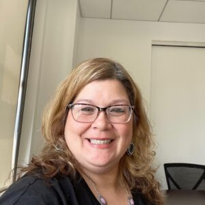
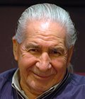
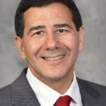
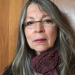

## Staff

### Gaeñ hia uh, Betty Hill (Lyons)  
(Onondaga Nation, Snipe Clan)

#### President & Executive Director

Betty Lyons, President & Executive Director of the American Indian Law Alliance (AILA), is an Indigenous and environmental activist and citizen of the Onondaga Nation. Betty has worked for the Onondaga Nation for over 20 years. Ms. Lyons serves as a member of the Haudenosaunee External Relations Committee and has been an active participant at the annual United Nations Permanent Forum on Indigenous Issues (UNPFII) since the first session in 2001 as a delegate of the Onondaga Nation. Betty attended Cazenovia College and is a Bryant Stratton College Graduate of the Paralegal Program. In 2023 she received an honorary degree from Onondaga Community College (OCC) in honor of her advocacy. In 2024 she received a lifetime achievement award from the NYC Bar Association for her work advocating for Indigenous nations and peoples.

Under the Leadership of Tonya Gonnella Frichner, Betty worked closely with AILA since 1997 and joined AILA in 2014. During her time at AILA, Betty has worked on numerous issues, including: advocating for the Rights of Mother Earth, Treaty support, educating on the Doctrine of Discovery, advocates for Indigenous Nations and peoples at the United Nations, Right to Self Determination and Sovereignty, teaching the Indigenous history of women’s rights, honoring the Two Row Wampum Treaty in New York City, polishing the Covenant Chain with the United States as part of the Canandaigua Treaty obligations.

Betty continues to work for the protection of Indigenous peoples who are fighting to protect their traditions, territories, resources, and care for Mother Earth.

Out of her concern for Indigenous peoples and Mother Earth, Betty serves on numerous boards like: Connie Hogarth Center, [Center for Earth Ethics](https://centerforearthethics.org/), [The MOST](https://www.most.org/), [Skä•noñh- Great Law of Peace Center](https://www.skanonhcenter.org/) Academic Collaborative, she is an Advisory Committee Member for the [National Institute for Law and Justice](https://nilj.org/board), and is Co-Chair of the [Center of Earth Ethics Advisory Board](https://centerforearthethics.org/).

### Matthew Gonnella (Onondaga Heritage)

#### Advisory Associate

Matthew Gonnella, Esq. has been involved with the American Indian Law Alliance since 2013. A practicing attorney, Matthew currently represents individuals and families in all stages of deportation proceedings in federal immigration court with the law firm MacMurray & Associates in Boston, Massachusetts. Many of his clients are Indigenous peoples from Central America seeking asylum and protection under the United Nations Convention Against Torture.

Matthew also has a published work in the Suffolk University Law School Transnational Law Review titled “If You Are Not at the Table, Then You Are Probably on the Menu: Indigenous Peoples’ Participatory Status at the United Nations” SUFFOLK TRANSNAT’L L. REV. 145 (2018).

### Adam DJ Brett (Irish-American Heritage)

#### Operations Manager & International Research Associate

[Adam DJ Brett](https://www.adamdjbrett.com/) has been involved with the American Indian Law Alliance since 2016. He earned his Ph.D. in religion at Syracuse University, where he studied religion, media, and culture in the United States. As a student of religion, he is interested in the impact of the [Doctrine of Discovery](https://doctrineofdiscovery.org/), religious freedom, and how religion gets understood through law. Through his deep love of technology, Adam facilitates conference discussions and panels. Adam is an integral part of AILA, he is dedicated to forwarding the advancement of sovereignty and self-determination for Indigenous nations and peoples. 

### **Patricia (Patty) Gabriel (Onondaga Decent)**

#### Program Coordinator and Caseworker

Patricia Vogt is the Program Coordinator and Caseworker for the Executive Director of the American Indian Law Alliance. She is a descendant and daughter of an enrolled citizen of the Onondaga Nation, specifically from the Snipe clan. Patricia has worked for the Onondaga Nation for over 20 years in many capacities and has served as a supervisor for several of their programs. Ms. Vogt volunteers and serves as the co-treasurer of the Onondaga Nation Ladies Fire Department Auxiliary. 

Patricia graduated from Onondaga Community College in 2025 with an Associate's degree in Human Services. She is a certified CNA, Massage Therapist, and a former New York State Emergency Medical Technician. Patricia has also worked as a caseworker for Catholic Charities, working with the homeless population. Ms. Gabriel is a foster parent for the Onondaga Nation and has one child in her care. 

Patricia works in her capacity at the American Indian Law Alliance to defend Indigenous Peoples, Mother Earth, and all that inhabits her. Through the teachings of her family, she has developed a strong sense of responsibility to uphold and support the Haudenosaunee Confederacy. 

### **Melissa (Missey) Rank  
(Mohawk Nation, Wolf Clan)**

#### Executive Assistant and Event Specialist

Melissa Rank is the Executive Assistant and Event Specialist to the Executive Director of the American Indian Law Alliance. She is an enrolled Wolf Clan Citizen of the Akwesasne Mohawk Nation. Melissa’s maternal grandfather was an Onondaga Chief, and her paternal grandmother was an Oneida Clan Mother. Melissa worked for the Native American Service Agency as a family court liaison and community program director before attending Onondaga Community College and graduating in 2006. 

Melissa’s strong sense of community and Haudenosaunee values brought her back to the Onondaga Nation, where she worked for 12 years as the Athletic Director of the Onondaga Athletic Club. She served on many Boards of Directors for different sports organizations in the US and Canada as the secretary and registrar. She helped the organizations grow and expand, and she was the creator of many constitutions and by-laws. She also helped facilitate the necessary training and clinics to have the coaches and referees carded in the US and Canada.

Melissa served as the Executive Director of the Iroquois Lacrosse Association and the First Nations Lacrosse Association. She traveled extensively throughout Canada and organized team travel to several national championships. In 2011, she was the general manager for the U19 Haudenosaunee Women’s World Championship Team that traveled to Hanover, Germany. Melissa’s lacrosse knowledge and event planning led to the Head of Game Operations position at the 2015 Men’s World Indoor Lacrosse Championships that Onondaga hosted. She was selected to serve as the team host for Team Canada, which won the gold medal that year.

Melissa will work tirelessly and diligently at the American Indian Law Alliance to defend and uphold the beliefs and traditions of Indigenous people throughout the world. Protecting Mother Earth is a responsibility that has been instilled in Melissa through her family and culture. 

## Gwahuntiyosta/Tina Thomas (Onondaga Nation, Eel Clan)

### Consultant

Gwahuntiyosta (“She Has Beautiful Fields”), Tina Hill Thomas, is a member of the Onondaga Nation Eel Clan. Tina’s professional background is in Hotel and Restaurant Management, and she has been independently catering for over 10 years, specializing in traditional Haudenosaunee foods. Tina has worked as an Education Associate at the Skä•noñh-Great Law of Peace Center and is now continuing her work in cultural education and outreach through the American Indian Law Alliance. Tina is passionate about cultural revitalization, particularly through food, language, and ceremony.

* * *

## BOARD OF DIRECTORS

**Oren Lyons**, serves as the Onondaga Nation Turtle Clan Faith Keeper and as a member Chief of the Onondaga Council of Chiefs and the Grand Council of the Haudenosaunee Confederacy.

Oren holds the title of Professor Emeritus at SUNY Buffalo, has an honorary Doctor of Law Degree from his Alma Mater, Syracuse University, where Lyons Hall is named in his honor. Chief Lyons is an All-American Lacrosse Hall of Famer and Honorary Chairman of the Iroquois Nationals Lacrosse Team. He is an accomplished artist, environmentalist, and author.

Oren is a leading voice at the UN Permanent Forum on Human Rights for Indigenous Peoples, serves on the Executive Committee of Spiritual and Parliamentary Leaders for Human Survival, serves on the Board for Harvard Project on American Indian Economic Development, as Principal of One Bowl Productions, and honorary board member for 4 The Future Foundation.

Recipient of several prestigious awards including; The United Nations NGO World Peace Prize, the Ellis Island Congressional Medal of Honor, The Rosa Parks and George Arent Award for environmental and social activism and recently receiving Sweden’s prestigious Friends of the Children Award with his colleague the late Nelson Mandela. Recipient of Green Cross International Environmental Icon Award 2019.

**Herb Frichner (Emeritus Board Member)** is a seasoned fashion marketing entrepreneur with extensive experience in the fashion industry. Mr. Frichner conceived, developed, operated, and owned Panache New York, Ltd. for over thirty years, a fashion-forward coat, rainwear, and outerwear company targeting the upscale, sophisticated, and tasteful female consumer. He was frequently quoted in various media venues and is regarded as a fashion marketing expert. Mr. Frichner has served as an adjunct associate professor in the Fashion Merchandising and Marketing Department of the Fashion Institute of Technology for the past thirty-five years and for a five-year period as an assistant professor of marketing at Parsons' School of Design. Throughout his career, Mr. Frichner was a conscientious and socially responsible entrepreneur, committed to philanthropy and contributing to the welfare of consumers and society as a whole.

**Leo J. Nolan III,** M.Ed., (Akwesasne Mohawk Nation) was raised on the Onondaga Nation and has more than 40 years of experience in Indian health care and education. Mr. Nolan also plays a key role with the Center in developing partnerships with tribes and organizations that share similar values and goals, and assisting in fundraising. Mr. Nolan retired from IHS in 2011 after 25 years, the last 12 as the external affairs director. Mr. Nolan began his federal government career with the Indian Education Program and then the Department of Education, and has also worked at the BIA’s Indian Education Program, the Senate Committee on Indian Affairs and in the State University of New York system. Mr. Nolan is from the Onondaga Nation and is an enrolled member of the Akwesasne Mohawk Nation and has degrees from Syracuse University and the Pennsylvania State University. Mr. Nolan is also a Board Member of the Iroquois Nationals.

**Dr. Brian Thompson MD. (Oneida/Onondaga Nation)** is the Assistant Dean for Diversity, SUNY Upstate Medical University. He was appointed to the OB/GYN department at Upstate Medical University in February 2004. He is board certified in obstetrics and gynecology.Dr. Thompson’s clinical interests include abnormal uterine bleeding, cervical dysplasia, menstrual disorders, and uterine fibroids. He is also interested in Native American healthcare and underserved patient populations.

**Sandra Bigtree, Treasurer** is a citizen of the Mohawk Nation at Akwesasne. She is a founding board member of the Indigenous Values Initiative (501C3), which fosters collaborative educational work between the academic community and the Haudenosaunee to promote the message of peace that was brought to Onondaga Lake thousands of years ago. It is this message that continues to influence American Democracy, the women’s rights movement, and the Environmental Justice Movement. She helped organize the: “Roots of Peacemaking” educational festivals in 2006 and 2007; the “Doctrine of Discovery Conference” in 2014; and co-edited the Neighbors of the Onondaga Nation (NOON) educational booklet. She was an original Planning Committee member of Skä•noñh: the Great Law of Peace Center and currently sits on the Educational Collaborative committee. In 1984-85, she was the Administrative Assistant to the American Indian Law Support Center at the Native American Rights Fund in Boulder, CO.\* In 1980-82 she performed with Native Americans in the Arts theatre troupe (an affiliate of the American Indian Community House) at LaMama, NYC, and toured the northeastern US. From age 1-30, Sandy performed weekly on radio, TV and other venues around Central New York. She is best known for fronting the “Sandy Bigtree Band” in the mid-1970s. Show business is a “tradition” that began with her grandfather Mitchell Bigtree’s escaped from Thomas Indian Boarding School to join Buffalo Bill’s Wild West Show in Europe. His most memorable performance was at Queen Victoria’s Golden Jubilee.
