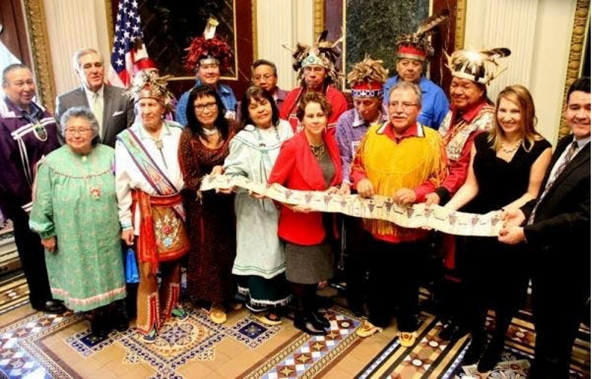

Below are some photos from the 1794 Covenant Chain polishing ceremony with [Hanadagá•yas](https://www.onondaganation.org/history/us-presidents-hanadagayas/) Barack Obama in 2016

[**➞ We encourage everyone to read the full text of the 1794 Canandaigua Treaty**](https://www.onondaganation.org/government/the-canandaigua-treaty-of-1794/)

\[caption id="attachment\_10788" align="alignnone" width="977"\] Haudenosaunee Nation leaders, clan mothers and U.S. Government officials hold the belt George Washington had made and had presented to the Haudenosaunee in 1794 at the Canandaigua Treaty.  
Feb 25, 2016\[/caption\]

\[caption id="attachment\_10790" align="aligncenter" width="977"\] Polishing the Covenant Chain\[/caption\]
