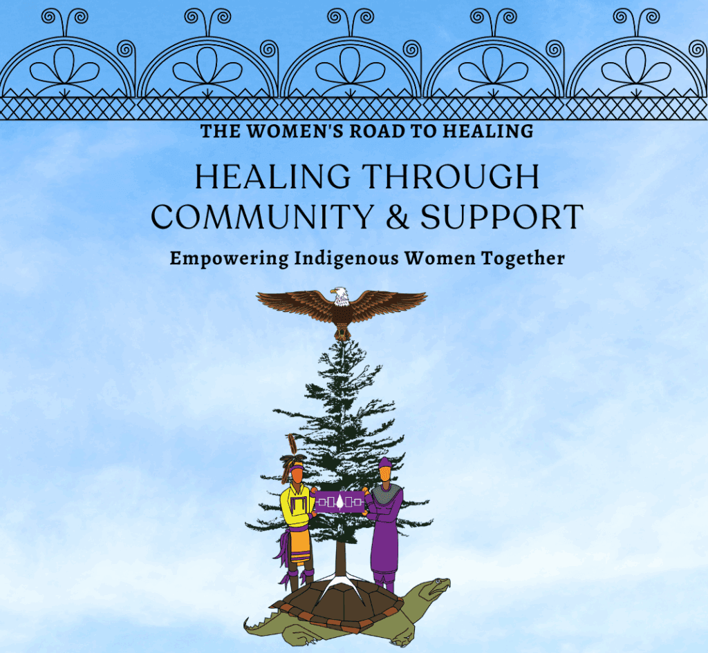
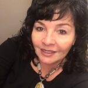

# An NGO in consultative status with the United Nations Economic & Social Council (ECOSOC)

The American Indian Law Alliance (AILA) was founded in 1989; it is an Indigenous, non-profit, non-partisan organization that works with Indigenous nations, communities, and organizations in our struggle for sovereignty, human rights, and social justice for our peoples.

[Request a Speaker](http://aila.ngo/request-a-speaker/)

[Contact us](http://aila.ngo/contact/)

[Upcoming Events](http://aila.ngo/category/events/)

## A passion for sovereignty & healing all our relations

Advocating for Indigenous sovergnty and living in right and proper relationship with all living beings and our Mother the Earth.

### Return Maple Bay

Heal the Reciprocal Relationship Between Ononodaga Lake and Onondaga Nation.

[#Lakeback](https://lakeback.org/)

### Doctrine of Discovery

We  are committed to confronting and combating the Doctrine of Discovery.

[Doctrine of Discovery](http://aila.ngo/issues/doctrine-of-discovery/)

### Canandaigua Treaty of 1794

Advocating for the honoring of our treaty rights and protections.

[Treaty of Canandaigua](http://aila.ngo/issues/canandaigua-treaty-of-1794/)

### Original Instructions

Over a thousand years ago on the shores of Onondaga Lake, a democracy that centered the rights of all living beings was born.

[Original Instructions](http://aila.ngo/issues/original-instructions/)

### Rights of Mother Earth

We have a sacred obligation regarding our environment; these are ancient laws handed down from one generation to the next.

[Rights of Mother Earth](http://aila.ngo/issues/rights-mother-earth/)

### Two Row Wampum

Two Row Wampum is a living treaty and a way for humans to live in harmony with one another and the natural world.

[Two Row Wampum](http://aila.ngo/issues/two-row-wampum/)

### Women's Rights

In Haudenosaunee Confederacy societies, women have always had a central role in governance and culture..

[Women's Rights](http://aila.ngo/issues/original-instructions/http://aila.ngo/issues/womens-rights/)

### Sovereignty

We have a sacred obligation regarding our environment; these are ancient laws handed down from one generation to the next.

[Rights of Mother Earth](http://aila.ngo/issues/rights-mother-earth/)

### Intenational Advocacy

The Haudenosaunee have participated in international diplomacy dating back to at least the League of Nations.

[United Nations](http://aila.ngo/about/our-history/league-of-nations-united-nations-participation/)

## Scope of Work

Protecting the Rights of Mother Earth, Empowering Indigenous Women & Children, Dismantling the Doctrine of Discovery, Advancing the Rights of Indigenous Peoples, and Public Education.

### United Nations

- [Global Indigenous Women's Caucus](http://aila.ngo/category/united-nations/giwc/).

- [Global Indigenous Peoples Caucus](http://aila.ngo/category/united-nations/gipc/).

- [Indigenous Craft Fair](http://aila.ngo/category/united-nations/craft-fair/).

### Social Services

- Language Courses.

- Elders Lunch.

- Food Boxes.

_“How do you pollute your Mother the Earth?”_

Betty Hill (neé Lyons)

Executive Director

## Join 900+ subscribers

Stay in the loop with everything you need to know.

Sign up
