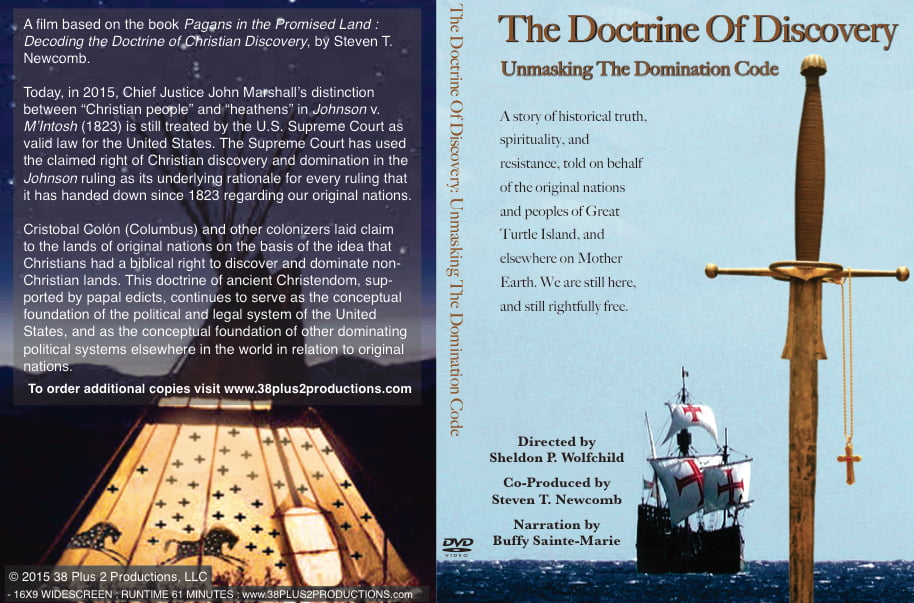

_Significant aspects of this research were published in the New York University Review of Law & Social Change_ (Vol. 20, Number 2, 1993), “The Evidence of Christian Nationalism in Federal Indian Law.”

* * *

[The American Indian Law Alliance](http://aila.ngo) expresses its gratitude to Steve for allowing us to reprint this article on our website. We feel that it is important information for anyone interested in the origins of discrimination against Indigenous peoples and the Indigenous struggle to overcome international and domestic law that is still based on racist doctrines which continue to hinder our work into the 21st century.

> _**“… the Christian religion be everywhere increased and spread”**_ **and** _**“barbarous nations be overthrown and brought to the faith itself.”**_ **_Inter Cetera_ bull issued by Pope Alexander, May 4, 1493**

When Cristobal Colon (Columbus) first set foot on the white sands of Guanahani Island, he performed a ceremony to “take possession” of the land for the kind and queen of Spain. Although the story is a familiar one, few people are aware of the basis for the Spanish Admiral’s act of “possession.”

Under the laws of Spain and of Christendom, Columbus laid claim to Guanahani and subsequent lands on the basis of the Doctrine of Christian Discovery. In 1992 much of the world commemorated Colon’s voyage. And this ancient Christian doctrine, of what was then the Catholic world, still serves as the foundation of federal Indian law in the United States.

To understand the connection between the Doctrine of Christian Discovery and the laws of the United States, we must recall a document issued forty years before Columbus’ historic voyage. In 1452, Pope Nicholas V gave permission to King Alfonso of Portugal “_to capture, vanquish and subdue, all_ Saracens, Pagans, and _other enemies of Christ_,” “_to take all their possessions and property_,” and _“to put them into perpetual slavery._[_**\[1\]**_](#_ftn1)

With this document Pope Nicholas _declared war against all non-Christians throughout the world._ Because at that time Christians viewed themselves as being at war with all non-Christians, “_it was customary for Christians to view “infidels” as enemies, to be treated as wild animals, or beasts of prey.__”_[_**\[2\]**_](#_ftn2) Under Christian international law, heathens and infidels[\[3\]](#_ftn3) were considered to be less than human.[\[4\]](#_ftn4)

> **Christians also believed that the Bible granted them** _**“… a two-edged sword in their hand; to execute vengeance upon the heathen, … to bind their kings with chains, and their nobles with fetters of iron.”**_ **Psalm 149: 6-8**

In 1492, financed in part by the Royal Treasurers of the Crusade, Colon made his famous journey across the Sea of Darkness on the basis of the same militaristic doctrine promulgated by Pope Nicholas V. Accordingly, Colon ‘claimed’ for the use and profit of Spain and the Christian world, all the lands he ‘discovered.’ When Pope Alexander VI heard of Colon’s successful voyage of ‘discovery,’ he promptly issued several papal decrees confirming the ‘discovered’ lands to the monarchs of Spain while protecting Portuguese interests previously affirmed by the Church.

In the I_nter Cetera_ bull of May 4, 1493,[\[5\]](#_ftn5) Pope Alexander declared it to be his desire that “_the Catholic faith and Christian religion be everywhere increased and spread,”_ and that _“barbarous nations be overthrown and brought to the faith itself.”_[_**\[6\]**_](#_ftn6) In another passage of the bull, the pope stated, _”we trust in Him from whom empires and dominations and all good things proceed.__”_[_**\[7\]**_](#_ftn7)

Lands which had no Christian owner were considered to be vacant lands, even though inhabited by Indigenous nations.

In the pope’s opinion, non-Christian Native nations were living outside the authority of the “_Christian empire.”_[_**\[8\]**_](#_ftn8) Consequently, the Christian world sought to force the Native nations to bow in obedience and become subservient to the dominion (subduing power) of the Cross and Crown. This, the Christian world believed, was in keeping with passages from the Bible such as Psalms 2:8: _“I shall give to thee the heathen for thine inheritance and the uttermost parts of the earth for thy possession.”_ As a result of the pope’s leadership, advocating warfare rather than peace, the Christian world steadfastly refused to respect the Native nations of the Western Hemisphere.

Because of their lack of respect for cultures that were not Christian, the seafaring nations of Christendom _assumed dominion_ and _jurisdiction_ over Native peoples and their lands. Support for this assumption of dominion was also found in the Bible. Colon’s favorite passage from the Bible was Psalms 72:8-11: _“He shall have dominion from sea to sea, and from the river unto the ends of the earth. They that dwell in the wilderness shall bow before him \[the Lord\]; and his \[the Lord’s\] enemies shall lick the dust… Yea, all kings shall fall down before him; all \[heathen\] nations shall serve him \[the Lord\].__”_[_**\[9\]**_](#_ftn9) Colon was merely the forerunner who brought this way of thinking to the Americas, which the pope supported through papal edicts that presumed to grant away the lands of Native nations and peoples. According to the international law of the Christian Commonwealth, lands which had no Christian owner were considered to be vacant lands, even though inhabited by Indigenous nations.[\[10\]](#_ftn10) In keeping with the militaristic doctrine promulgated by Pope Nicholas V, the first Christian nation to “discover” lands inhabited by heathens and infidels (_‘beasts of prey’)_ supposedly had the absolute title to and the ultimate dominion over those lands.[\[11\]](#_ftn11) Spain, Portugal, France, England, Holland, Sweden and Russia, all embraced and acted on this doctrine.

> _**“As infidels, heathens and savages,**_ **_they_ \[Indians\] _were not allowed to possess the prerogatives belonging to absolute, sovereign and independent nations.”_** 
> 
> **Supreme Court Justice of the United States of America, Joseph Story**

In 1823, this same doctrine of “discovery” was formally written in to the political and legal framework of the United States by the U.S. Supreme Court. In the case _Johnson v. McIntosh_(8Wheat., 542, 1823), Chief Justice Marshall said that _“discovery gave title to the government, by whose subject, or by whose authority, it was made, against all other European governments.__”_[_**\[12\]**_](#_ftn12)

Marshall cited various charters to document England’s acceptance of the Discovery Doctrine. _“So early as 1496,”_ wrote the chief justice, _“her monarch granted a commission to the Cabots, to discover countries then unknown to_ Christian people, _and to take possession of them in the name of the king of England_ \[emphasis on ‘Christian people’ by Marshall\].”[\[13\]](#_ftn13) The Christian European nations making such discoveries only had an obligation to recognize the “_prior title of any Christian people who may have made a previous discovery.”_[_**\[14\]**_](#_ftn14) In short, it was the United States Supreme Court’s position that Christian “discovery” gave the Christian monarch title to sovereignty and dominion, while supposedly leaving the Native “heathens” with a mere right of occupancy, “_subject to the superior sovereignty of the particular_ \[Christian\] _European nations, which actually held the title of discovery.”_[_**\[15\]**_](#_ftn15)

Few people realize that the United States Supreme Court’s _Christian/heathen distinction_ is still regarded as the supreme Law of the Land in the United States today. The Court has ever since used the pre-colonial _[Doctrine of Discovery](http://aila.ngo/issues/doctrine-of-discovery/) and Dominion_ as the _premise_ of _every_ ruling that it has handed down, with regard to Indian sovereignty and land rights. The result is the same as if the doctrine of Christian discovery had been written into the United States Constitution. Based on that doctrine, Indian nations are still, to this day, denied the right to freely maintain their cultural existence and their territorial integrity, simply because their ancestors were not baptized Christians at the time of European arrival.[\[16\]](#_ftn16)  This is the hidden basis that the United States uses in continuing to deny that Indian nations have true territorial rights in their own ancestral homelands. In the words of Supreme Court Justice Joseph Story, _“As infidels, heathens, and savages, they \[_the Indians_\] were not allowed to possess the prerogatives belonging to absolute, sovereign and independent nations.”_[_**\[17\]**_](#_ftn17)

Lieber, a noted legal scholar and friend of Justice Story, explained that “_paganism”_ (i.e., heathens and infidels), which meant “_being unbaptized,”_ deprived Indigenous peoples of “_those rights which a true jural_ \[legal\] _morality considers inherent in each human being.”_

### Conclusion

In United States law, early documents of “discovery” and conquest, issued by a number of fifteenth century popes, form the basis of denial of the rights of Indian nations and peoples. As a result, **the United States continues to deny that Indians have complete rights of sovereignty and territorial integrity, simply because Indians were not Christians at the time of Christendom’s arrival to the Western Hemisphere**. By dehumanizing Indian people, and by considering their territories as being, with “_respect to Christians,” “inhabited only by brute animals,”_[_**\[18\]**_](#_ftn18) the Christian world created a system of colonization that has not yet ended.

After half a millennium, it is now time for the Indigenous peoples of the Western Hemisphere, in solidarity with their allies and supporters, to united in calling upon Pope John Paul II to formally revoke the _[Inter Cetera](https://doctrineofdiscovery.org/inter-caetera/)_ bull, and to call upon the United States to overturn the [_Johnson v. McIntosh_](https://doctrineofdiscovery.org/johnson-v-mcintosh/) decision and its currently active precedent of Christian discovery and dominion.

[➞ The Domination Code is now streaming online](https://vimeo.com/ondemand/dominationcode).

### Notes

[\[1\]](#_ftnref1) _European Treaties Bearing on the History of the United States and its Dependencies,_ (Francis G. Davenport ed., 1917), p. 23. Hereafter cited as “Treaties.”

[\[2\]](#_ftnref2) Henry Wheaton, _Elements of International Law_, 1855 (Sixth ed.), p. 219. Wheaton, official U.S. Supreme Court Reporter at the time of _Johnson v. McIntosh_, points out that form the standpoint of “_the Christian powers themselves”_ during the fifteenth and sixteenth centuries, _“the heathen nations of the other quarters of the globe were the lawful spoil and prey of their civilized conquerors.”_

[\[3\]](#_ftnref3) The words “heathen” (people of the heath) and “infidel” (those not of the faith) are no longer in current use. _The Oxford English Dictionary,_ (Second ed., Vol. VII, 1989, p. 75) defines “heathen” as a term of “_Christian origin.”_ It said, to be applied to those whose religion is neither Christian, Jewish or Moslem. The legal sourcebook _Words and Phrases,_ 1960, p. 593, defines “infidel” as being “_any person or people that does not believe in the God of the Bible”_ and “_that does not believe that Jesus Christ was the true Messiah.”_

[\[4\]](#_ftnref4) Francis Lieber, _Miscellaneous Writings,_ p. 24, 1880. Lieber, a noted legal scholar and friend of Justice Story, explained that “_paganism”_ (i.e., heathens and infidels), which meant “_being unbaptized,”_ deprived Indigenous peoples of “_those rights which a true jural_ \[legal\] _morality considers inherent in each human being.”_

[\[5\]](#_ftnref5) Treaties, pp. 56-63.

[\[6\]](#_ftnref6) Ibid., p. 61.

[\[7\]](#_ftnref7) Ibid., p. 63. The exact quote is _“We trust in Him from whom empires and governments and all good things proceed.”_ However, the original Latin reads, “_inIllo que emperia et dominations ac bona cuncta procedunt confidentes….”_ The Latin “_dominationes”_ translates into the English word “governments.” In other words, the pope clearly implies that _governments are forms of domination._ 

[\[8\]](#_ftnref8) John Boyd Thacher, _Christopher Columbus,_ (1903), p. 127.

[\[9\]](#_ftnref9) A similar passage from Psalm 149: 6-8, seems to grant Christians “_…a two-edged sword in their hand; to execute vengeance upon the heathen, … to bind their kinds with chains, and their nobles with fetters of iron.”_

[\[10\]](#_ftnref10) Benjamin Munn Ziegler, _The International Law of John Marshall,_ (1939), pp. 45-46. Ziegler observes, that “\[o\]_ne of the oldest means by which nations have acquired territory has been through the discovery of previously unoccupied lands,”_ and then notes in passing: _“The term ‘unoccupied lands’ refers of course to the lands in America which when discovered were ‘occupied by Indians’ but ‘unoccupied’ by Christians.”_ See also, “Cross preceded sword in ‘Discovery’ of the Americas,” _Yakima Nation Review_ (October, 1991, p. 10). Luis N. Rivera-Pagan, associate professor of the humanities at the University of Puerto Rico, stated that he lands Columbus took into possession were considered as “_belonging to nobody”_ because _“they were not the property of any Christian nation.”_

[\[11\]](#_ftnref11) _The Oxford English Dictionary_ (2d ed. 1989) defines _dominion_ as “_the power or right of governing and controlling; sovereign authority; lordship; sovereignty; rule, sway; control, influence”_ and _“\[t\]he lands or domains of a feudal lord;”_ but also as, _“ownership; property; right of possession.”_ Thus, the reasoning behind the Doctrine of Christian Discovery and Dominion was based on the background premise that “God’s Chosen People” (baptized and incorporated into the Body of Christ) and biblical permission to locate (“discover”) and then “take possession” of their rightful or “God-given” position of supreme rule (Empire-dominion-domination-sovereignty) over all non-Christian lands and peoples throughout the globe.

[\[12\]](#_ftnref12) _Johnson & Graham’s Lessee v. McIntosh,_ 8 Wheat., (1823), p. 573.

[\[13\]](#_ftnref13) Ibid., pp. 576-77.

[\[14\]](#_ftnref14) Ibid.

[\[15\]](#_ftnref15) Ibid. p. 574.

[\[16\]](#_ftnref16) B.A. Hinesdale, “The Right of Discovery,” in _Ohio Archeological and Historical Quarterly_, Vol: II, No. 3, p. 34. Hinesdale explains that the Doctrine of Discovery is historically based on the Christian Empire’s definition of Indigenous peoples as “nullus”, a definition apparently supplied by the Catholic Church. The definition of “nullus”, says Hinesdale, was a “_heathen, pagan, infidel, or unbaptized person.”_

[\[17\]](#_ftnref17) \[Supreme Court Justice\] Joseph Story, _Commentaries on the Constitution of the United States_, (5th ed., Vol. I) 1891, p.106.

[\[18\]](#_ftnref18) Ibid., _“The territory over which they_ \[the Indians\] _wandered, and which they used for their temporary fugitive purposes, was, in respect to Christians, deemed as if it were inhabited only by brute animals.”_

 

* * *

## Byline

### By [Steven T. Newcomb](https://originalfreenations.com/)

#### © 1992, 1995, Eugene, Oregon. All rights reserved.

_Comments and requests for further information are invited._ 

_Indigenous Law Institute_ _PO Box 188_ _Alpine, CA 91901_ _619-445-1167_

* * *

_Steven T. Newcomb (Shawnee/Lenape) is director of the Indigenous Law Institute in Eugene, Oregon. He has investigated the origins of U.S. federal Indian law, and international law, since 1981._ 

 

### Watch Domination Code Film

