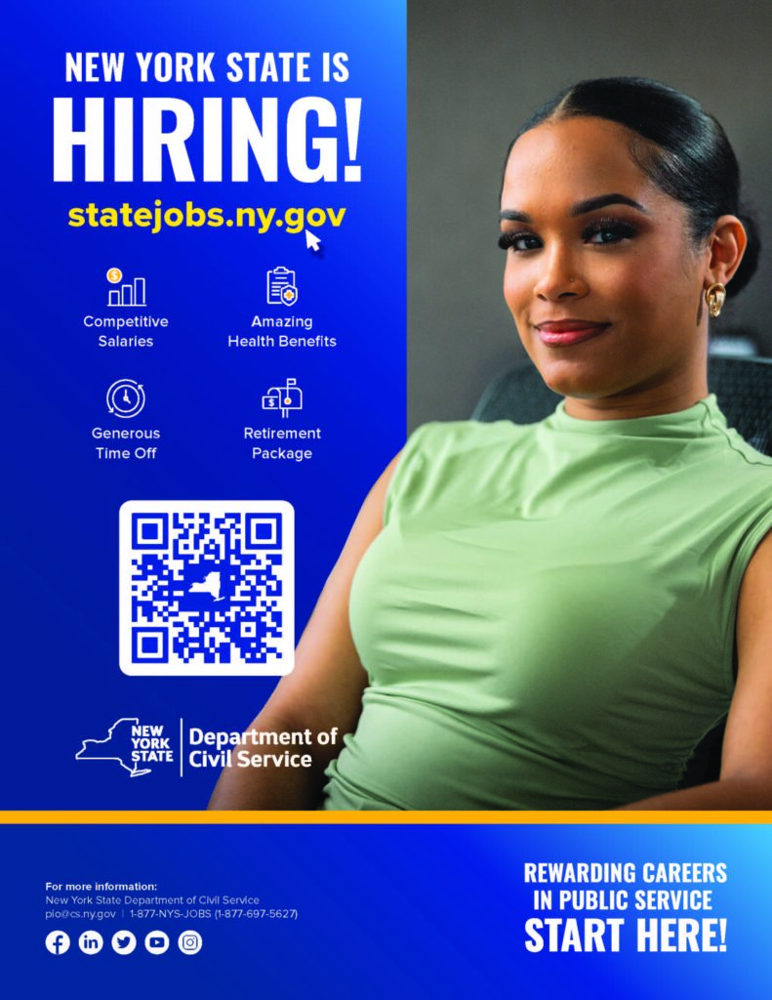

We are excited to announce the launch of the **New York Hiring for Emergency Limited Placement Statewide (NY HELPS) program.**

The NY HELPS program was created to help New York State agencies fill thousands of critical positions open across the state.

This initiative streamlines the appointment process to allow State agencies to hire **diverse, qualified permanent employees** quickly and **without examinations**. New employees hired under the NY HELPS Program will be appointed on a permanent basis.

To spread the word, we are also kicking off a new public awareness campaign to inform New Yorkers about the benefits and varied opportunities available as a New York State employee. The message is simple, yet resonant: “It is easier than ever to get a job with New York State, and now is the time to apply.”

**Please help us get the word out that there are _thousands_ of careers with New York State**! Please visit the following link to access a campaign video and information brochure to share with your communities:

https://cs.ny.gov/marketing-campaign-2024/

If you have any questions about NY HELPS, or would like to discuss collaborating further, please feel free to reach out to me.

Thank you—I look forward to our ongoing partnership in promoting pathways to public service careers.
