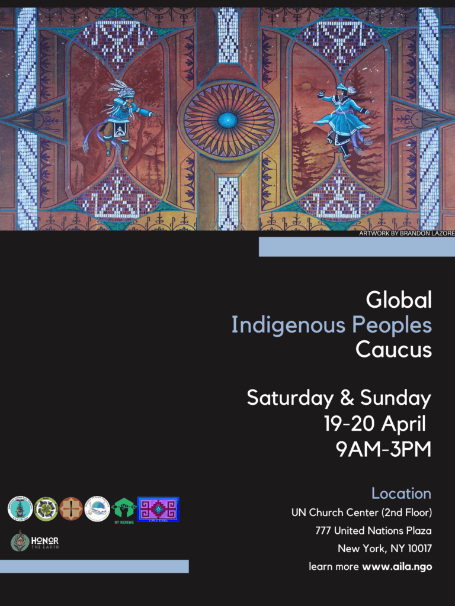

## [English](#en) |  [Español](#es) | [Français](fr) | [Russian](http://aila.ngo/announcing-the-2025-global-indigenous-peoples-caucus-gipc/#ru)

## English

## **Global Indigenous Peoples Caucus (GIPC) Invitation**

### Dear Relatives,

We invite you to join us on the 19-20 April 2025 from 9:00 AM––3:00 PM on the Second Floor of the Church Center of the United Nations (CCUN) located at 777 United Nations Plaza, New York, NY 10017. We look forward to welcoming each of you in person.

As we prepare for the upcoming twenty-fourth session of the UN Permanent Forum on Indigenous Issues which will take place in person from **21 April to May 2, 2025. This year's theme is Implementing the United Nations Declaration on the Rights of Indigenous Peoples within the United Nations Member States and the United Nations system, including identifying good practices and addressing challenges** . The UNPFII takes place at the United Nations Headquarters in New York.

We ask that in preparation for the Global Indigenous People's Caucus you do the following:

- [Review the UN Declaration on the Rights of Indigenous Peoples](https://www.un.org/development/desa/indigenouspeoples/declaration-on-the-rights-of-indigenous-peoples.html) [English](https://documents-dds-ny.un.org/doc/UNDOC/GEN/N06/512/07/PDF/N0651207.pdf?OpenElement) [|](https://documents-dds-ny.un.org/doc/UNDOC/GEN/N06/512/07/PDF/N0651207.pdf?OpenElement) [Español](https://documents-dds-ny.un.org/doc/UNDOC/GEN/N06/512/07/PDF/N0651207.pdf?OpenElement) [|](https://documents-dds-ny.un.org/doc/UNDOC/GEN/N06/512/07/PDF/N0651207.pdf?OpenElement) [Français](https://documents-dds-ny.un.org/doc/UNDOC/GEN/N06/512/07/PDF/N0651207.pdf?OpenElement) [|](https://documents-dds-ny.un.org/doc/UNDOC/GEN/N06/512/07/PDF/N0651207.pdf?OpenElement) [Russian](https://documents-dds-ny.un.org/doc/UNDOC/GEN/N06/512/07/PDF/N0651207.pdf?OpenElement) [|](https://documents-dds-ny.un.org/doc/UNDOC/GEN/N06/512/07/PDF/N0651207.pdf?OpenElement) [عربي](https://documents-dds-ny.un.org/doc/UNDOC/GEN/N06/512/07/PDF/N0651207.pdf?OpenElement) [|](https://documents-dds-ny.un.org/doc/UNDOC/GEN/N06/512/07/PDF/N0651207.pdf?OpenElement)[汉语](https://documents-dds-ny.un.org/doc/UNDOC/GEN/N06/512/07/PDF/N0651207.pdf?OpenElement)(Official Resolution Text)
- Read the UNPFII: Provisional Agenda

**Provisional Agenda for the twenty-fourth session (** [**E/C.19/2025/1**](https://documents.un.org/doc/undoc/gen/n25/000/04/pdf/n2500004.pdf) **)**

1. Election of officers.
2. Adoption of the agenda and organization of work.
3. Discussion on the theme “Implementing the United Nations Declaration on the Rights of Indigenous Peoples within United Nations Member States and the United Nations system, including identifying good practices and addressing challenges.”
4. Discussion on the six mandated areas of the Permanent Forum (economic and social development, culture, environment, education, health and human rights), with reference to the United Nations Declaration on the Rights of Indigenous Peoples and the 2030 Agenda for Sustainable Development.
5. 5\. Dialogues:
    1. (a) Dialogue with Indigenous Peoples;
    2. (b) Dialogue with Member States;
    3. (c) Dialogue with the United Nations agencies, funds and programs;
    4. (d) Human rights dialogue with the Special Rapporteur on the rights of Indigenous Peoples and the Expert Mechanism on the Rights of Indigenous Peoples; annual review of progress on the implementation of general recommendation No. 39 (2022);
    5. (e) Interregional, intergenerational and global dialogue;
    6. (f) Dialogue on Indigenous platforms established within United Nations entities;
    7. (g) Thematic dialogue on the financing of Indigenous Peoples' work and participation across the multilateral and regional system.
6. Future work of the Permanent Forum, including issues considered by the Economic and Social Council, the outcome document of the World Conference on Indigenous Peoples and emerging issues.
7. Provisional agenda of the twenty-fifth session of the Permanent Forum.
8. Adoption of the report of the Permanent Forum on its twenty-fourth session.

### Selected Previous Statements

- [Review of the 2024 Statement](http://aila.ngo/2024-global-indigenous-peoples-caucus-statement/)
- [Review of the 2023 Statement](http://aila.ngo/global-indigenous-peoples-caucus-statement-for-unpfii22/)
- [Review of the 2022 Statement](http://aila.ngo/global-indigenous-peoples-outcome-document/)
- [Review of the 2018 Statement](http://aila.ngo/wp-content/uploads/2025/04/GIPC-2018-statement.pdf)
- [Review of the 2017 Statement](http://aila.ngo/wp-content/uploads/2025/04/2017-GIPC.pdf)
- [Review of the 2016 Statement](http://aila.ngo/wp-content/uploads/2025/04/2016-GIWC.pdf)
- [Review of the 2015 Statement](http://aila.ngo/wp-content/uploads/2025/04/2015-GIWC.pdf)
- [Review of the 2014 Statement](http://aila.ngo/wp-content/uploads/2025/04/2014-GIWC.pdf)

Breakfast and lunch will be provided; no registration is necessary; as always, all Indigenous Peoples are welcome. As more logistical information becomes available, it will be shared here and on the GIPC listserv. If you have questions, please email **aila@aila.ngo** .

**Special thanks to**

- Flying Eagle Women Fund
- United Methodist Women
- DOCIP for interpretation
- Brandon Lazore for the artwork

### **Sponsors**

Thank you to our sponsors

- American Indian Law Alliance
- American Indian Community House
- Honor the Earth
- Indigenous Values ​​Initiative
- NY Renews
- Peace Development Fund
- Sacred Places Institute for Indigenous Peoples (SPI)
- Tonatierra

- Agenda [EN](http://aila.ngo/wp-content/uploads/2025/03/2025-GIPC-AGENDA-EN.pdf) , [ES](http://aila.ngo/wp-content/uploads/2025/03/2025-GIPC-Agenda-ES.pdf) , [FR](http://aila.ngo/wp-content/uploads/2025/03/2025-GIPC-AGENDA-FR.pdf) , [RU](http://aila.ngo/wp-content/uploads/2025/03/2025-GIPC-Agenda-RU.pdf)

## Spanish

## **Invitación al Caucus Global de Pueblos Indígenas (GIPC)**

###  Estimadas hermanas y hermanos:

Los invitamos a que nos acompañen el 19 y el 20 de abril de 2025 de 9:00 a 15:00 en el segundo piso del Church Center de las Naciones Unidas (CCUN) situado en el 777 United Nations Plaza, NY 10017, en Nueva York. Estamos deseando darle la bienvenida en persona a cada uno de ustedes.

Nos estamos preparando para el 24º período de sesiones del Foro Permanente para las Cuestiones Indígenas, que se celebrará de manera presencial del 21 de abril al 2 de mayo de 2025. **El tema de este año es: “****Aplicación de la Declaración de las Naciones Unidas sobre los Derechos de los Pueblos Indígenas en los Estados Miembros de las Naciones Unidas y el sistema de las Naciones Unidas, incluidos la determinación de buenas prácticas y el afrontamiento de los desafíos****”.** El Foro Permanente tendrá lugar en la sede de las Naciones Unidas en Nueva York.

Les rogamos que, con vistas a prepararse para el Caucus Global de Pueblos Indígenas, hagan lo siguiente:

- [Revisar la Declaración de las Naciones Unidas sobre los Derechos de los Pueblos Indígenas](https://social.desa.un.org/issues/indigenous-peoples/united-nations-declaration-on-the-rights-of-indigenous-peoples) [English](about:blank) [|](about:blank) [Español](about:blank) [|](about:blank) [Français](about:blank) [|](about:blank) [Русский](about:blank) [|](about:blank) [عربي](about:blank) [|](about:blank) [汉语](about:blank) (Texto de la resolución oficial)
- Leer el programa provisional del Foro Permanente.
- **Programa provisional para el 24.º período de sesiones (**[**E/C.19/2025/1**](https://documents.un.org/doc/undoc/gen/n25/000/04/pdf/n2500004.pdf)**)**
    1. Elección de la Mesa
    2. Aprobación del programa y organización de los trabajos.
    3. Debate sobre el tema “Aplicación de la Declaración de las Naciones Unidas sobre los Derechos de los Pueblos Indígenas en los Estados Miembros de las Naciones Unidas y el sistema de las Naciones Unidas, incluidos la determinación de buenas prácticas y el afrontamiento de los desafíos”
    4. Debate sobre los seis ámbitos del mandato del Foro Permanente (desarrollo económico y social, cultura, medio ambiente, educación, salud y derechos humanos) en relación con la Declaración de las Naciones Unidas sobre los Derechos de los Pueblos Indígenas y la Agenda 2030 para el Desarrollo Sostenible.
    5. Diálogos:
        - a) Diálogo con los Pueblos Indígenas;
        - b) Diálogo con los Estados Miembros;
        - c) Diálogo con los organismos, fondos y programas de las Naciones Unidas;
        - d) Diálogo sobre derechos humanos con el Relator Especial sobre los derechos de los Pueblos Indígenas y el Mecanismo de Expertos sobre los Derechos de los Pueblos Indígenas; examen anual de los avances realizados en la aplicación de la recomendación general núm. 39 (2022);
        - e) Diálogo interregional, intergeneracional y global;
        - f) Diálogo sobre las plataformas Indígenas establecidas en las entidades de las Naciones Unidas
        - g) Diálogo temático, en particular sobre la financiación de la labor y la participación de los Pueblos Indígenas en el sistema multilateral y regional.
    6. Labor futura del Foro Permanente, incluidas las cuestiones examinadas por el Consejo Económico y Social, el documento final de la Conferencia Mundial sobre los Pueblos Indígenas y nuevas cuestiones.
    7. Programa provisional del 24º período de sesiones del Foro Permanente.
    8. Aprobación del informe del Foro Permanente sobre su 24º período de sesiones.

 

**Declaraciones previas**

- [Consultar la declaración de 2024](http://aila.ngo/2024-global-indigenous-peoples-caucus-statement/)
- [Consultar la declaración de 2023.](about:blank)
- [Consultar la declaración de 2022.](about:blank)

Se servirá desayuno y almuerzo. No es necesario registrarse. Como siempre, todos los Pueblos Indígenas son bienvenidos. A medida que haya más información logística disponible, se publicará aquí y en el listserv del GIPC. Si tienen alguna pregunta, pónganse en contacto con **aila@aila.ngo**.

**Un agradecimiento especial para:**

- Flying Eagle Woman Fund
- United Methodist Women
- DOCIP, por los servicios de interpretación
- Brandon Lazore, por el material gráfico

### **Patrocinadores**

Muchas gracias a nuestros patrocinadores:

- American Indian Law Alliance
- American Indian Community House
- Honor the Earth
- Indigenous Values Initiative
- NY Renews
- Fondo para el Desarrollo de la Paz
- Sacred Places Institute for Indigenous Peoples (SPI)
- Tonatierra

- Agenda [EN](http://aila.ngo/wp-content/uploads/2025/03/2025-GIPC-AGENDA-EN.pdf), [ES](http://aila.ngo/wp-content/uploads/2025/03/2025-GIPC-Agenda-ES.pdf), [FR](http://aila.ngo/wp-content/uploads/2025/03/2025-GIPC-AGENDA-FR.pdf), [RU](http://aila.ngo/wp-content/uploads/2025/03/2025-GIPC-Agenda-RU.pdf)

## Français

## **Invitation au Caucus global des Peuples Autochtones**

### 

### Chers tous,

Nous vous invitons à nous rejoindre les 19 et 20 avril 2025 de 9 h à 15 h au deuxième étage du Church Center of the United Nations (CCUN) situé au 777 United Nations Plaza, New York, NY 10017. Nous nous réjouissons de vous accueillir en personne.

Nous nous préparerons ensemble pour la vingt-quatrième session de l’Instance permanente des Nations Unies sur les questions autochtones, qui se tiendra en personne du **21 avril au 2 mai 2025**. Le thème de cette année est le suivant : « **L’application de la Déclaration des Nations Unies sur les droits des Peuples Autochtones dans les États Membres de l’ONU et le système des Nations Unies, y compris la détermination des bonnes pratiques et la résolution des difficultés** ». La session de l’UNPFII se déroule au siège des Nations Unies à New York.

En préparation du Caucus global des Peuples Autochtones, nous vous demandons de faire ce qui suit :

- [Lire ou relire la Déclaration des Nations Unies sur les droits des Peuples Autochtones](https://www.un.org/development/desa/indigenouspeoples/declaration-on-the-rights-of-indigenous-peoples.html) [Anglais](https://documents-dds-ny.un.org/doc/UNDOC/GEN/N06/512/07/PDF/N0651207.pdf?OpenElement) [|](https://documents-dds-ny.un.org/doc/UNDOC/GEN/N06/512/07/PDF/N0651207.pdf?OpenElement) [Español](https://documents-dds-ny.un.org/doc/UNDOC/GEN/N06/512/07/PDF/N0651207.pdf?OpenElement) [|](https://documents-dds-ny.un.org/doc/UNDOC/GEN/N06/512/07/PDF/N0651207.pdf?OpenElement) [Français](https://docs.un.org/A/Res/61/295) [|](https://documents-dds-ny.un.org/doc/UNDOC/GEN/N06/512/07/PDF/N0651207.pdf?OpenElement) [Русский](https://documents-dds-ny.un.org/doc/UNDOC/GEN/N06/512/07/PDF/N0651207.pdf?OpenElement) [|](https://documents-dds-ny.un.org/doc/UNDOC/GEN/N06/512/07/PDF/N0651207.pdf?OpenElement) [عربي](https://documents-dds-ny.un.org/doc/UNDOC/GEN/N06/512/07/PDF/N0651207.pdf?OpenElement) [|](https://documents-dds-ny.un.org/doc/UNDOC/GEN/N06/512/07/PDF/N0651207.pdf?OpenElement) [汉语](https://documents-dds-ny.un.org/doc/UNDOC/GEN/N06/512/07/PDF/N0651207.pdf?OpenElement) (Texte officiel de la résolution)
- Consulter l’ordre du jour provisoire de l’UNPFII

 

**Ordre du jour provisoire de la vingt-quatrième session (**[**E/C.19/2025/1)**](https://docs.un.org/fr/E/C.19/2025/1)

1. Élection du bureau.
2. Adoption de l’ordre du jour et organisation des travaux.
3. Discussion sur le thème « L’application de la Déclaration des Nations Unies sur les droits des Peuples Autochtones dans les États Membres de l’ONU et le système des Nations Unies, y compris la détermination des bonnes pratiques et la résolution des difficultés ».
4. Discussion sur les activités menées dans les six domaines d’action de l’Instance permanente (développement économique et social, culture, environnement, éducation, santé et droits humains) en relation avec la Déclaration des Nations Unies sur les droits des Peuples Autochtones et le Programme de développement durable à l’horizon 2030.
5. Dialogues:

(a) Dialogue avec les Peuples Autochtones ;

(b) Dialogue avec les États Membres ;

(c) Dialogue avec les organismes, fonds et programmes des Nations Unies ;

(d) Dialogue sur les droits humains avec le Rapporteur spécial sur les droits des Peuples Autochtones et le Mécanisme d’experts sur les droits des Peuples Autochtones ; examen annuel de l’état d’avancement de la mise en œuvre de la recommandation générale nº 39 (2022);

(e) Dialogue interrégional, intergénérationnel et mondial ;

(f) Dialogue sur les instances autochtones mises en place dans les entités des Nations Unies ;

(g) Dialogue thématique sur le financement des travaux et de la participation des Peuples Autochtones dans l’ensemble du système multilatéral et régional.

1. Travaux futurs de l’Instance permanente, notamment sur les questions intéressant le Conseil économique et social, sur le document final de la Conférence mondiale sur les Peuples Autochtones et sur les questions nouvelles.
2. Ordre du jour provisoire de la vingt-cinquième session de l’Instance permanente.
3. Adoption du rapport de l’Instance permanente sur les travaux de sa vingt-quatrième session.

**Déclarations du Caucus global des années précédentes**

- [Lire la déclaration de 2024](http://aila.ngo/2024-global-indigenous-peoples-caucus-statement/)
- [Lire la déclaration de 2023](http://aila.ngo/global-indigenous-peoples-caucus-statement-for-unpfii22/)
- Lire la déclaration de 2022

Le petit-déjeuner et le déjeuner seront offerts. Aucune inscription n’est nécessaire. Comme de coutume, tous les Peuples Autochtones sont les bienvenus. Au fur et à mesure que des informations logistiques seront disponibles, elles seront annoncées ici et à travers la liste du Caucus global des Peuples Autochtones. Pour toute question, merci d’envoyer un e-mail à **aila@aila.ngo**.

**Nous tenons à remercier particulièrement :**

- Le Flying Eagle Woman Fund
- United Methodist Women
- DOCIP pour l’interprétation simultanée
- Brandon Lazore pour l’illustration

### **Sponsors**

Merci à nos sponsors :

- American Indian Law Alliance
- American Indian Community House
- Honor the Earth
- Indigenous Values Initiative
- NY Renews
- Peace Development Fund
- Sacred Places Institute for Indigenous Peoples (SPI)
- Tonatierra

- Agenda [EN](http://aila.ngo/wp-content/uploads/2025/03/2025-GIPC-AGENDA-EN.pdf), [ES](http://aila.ngo/wp-content/uploads/2025/03/2025-GIPC-Agenda-ES.pdf), [FR](http://aila.ngo/wp-content/uploads/2025/03/2025-GIPC-AGENDA-FR.pdf), [RU](http://aila.ngo/wp-content/uploads/2025/03/2025-GIPC-Agenda-RU.pdf)

## Русский

## **Приглашение на Глобальный совет Коренных Народов (ГСКН)**

### 

### Дорогие братья и сёстры,

Приглашаем вас 19 и 20 апреля 2025 года на заседание ГСКН, которое пройдет с 9:00 до 15:00 на втором этаже Церковного центра Организации Объединенных Наций (CCUN) по адресу 777 United Nations Plaza, Нью-Йорк, NY 10017. Ждем с нетерпением возможности встретиться со всеми лично.

Совещание пройдет в рамках подготовки к предстоящей двадцать четвертой сессии Постоянного форума ООН по вопросам коренных народов, который состоится в очном формате **21 апреля по 1 мая 2025 года. Тема этого года: "Осуществление Декларации Организации Объединенных Наций о правах коренных народов в государствах — членах Организации Объединенных Наций и системе Организации Объединенных Наций, включая выявление примеров передового опыта и решение проблем"**. ПФКН проводится в Штаб-квартире Организации Объединенных Наций в Нью-Йорке.

В рамках подготовки к Глобальному совету Коренных Народов просим вас сделать следующее:

- [Ознакомьтесь с Декларацией ООН о правах коренных народов на](https://www.un.org/development/desa/indigenouspeoples/declaration-on-the-rights-of-indigenous-peoples.html) [английском](https://documents-dds-ny.un.org/doc/UNDOC/GEN/N06/512/07/PDF/N0651207.pdf?OpenElement) [|](https://documents-dds-ny.un.org/doc/UNDOC/GEN/N06/512/07/PDF/N0651207.pdf?OpenElement) [испанском](https://documents-dds-ny.un.org/doc/UNDOC/GEN/N06/512/07/PDF/N0651207.pdf?OpenElement) [|](https://documents-dds-ny.un.org/doc/UNDOC/GEN/N06/512/07/PDF/N0651207.pdf?OpenElement) [французском](https://documents-dds-ny.un.org/doc/UNDOC/GEN/N06/512/07/PDF/N0651207.pdf?OpenElement) [|](https://documents-dds-ny.un.org/doc/UNDOC/GEN/N06/512/07/PDF/N0651207.pdf?OpenElement) [русском](https://docs.un.org/A/Res/61/295) | арабском | китайском языках (официальный текст)
- Ознакомьтесь с предварительной повесткой дня ПФКН

**Предварительная повестка дня двадцать четвертой сессии (**[**E/C.19/2025/1**](https://docs.un.org/E/C.19/2025/1)**)**

1. Выборы должностных лиц.
2. Утверждение повестки дня и организация работы.
3. Дискуссия по теме: «Осуществление Декларации Организации Объединенных Наций о правах коренных народов в государствах — членах Организации Объединенных Наций и системе Организации Объединенных Наций, включая выявление примеров передового опыта и решение проблем»
4. Обсуждение шести определенных мандатом областей деятельности Постоянного форума (экономическое и социальное развитие, культура, окружающая среда, образование, здравоохранение и права человека) с учетом Декларации Организации Объединенных Наций о правах коренных народов и Повестки дня в области устойчивого развития на период до 2030 года.
5. Диалоги:
    1. (a) диалог с коренными народами;
    2. (b) диалог с государствами-членами;
    3. (c) диалог с учреждениями, фондами и программами Организации Объединенных Наций;
    4. (d) интерактивный диалог по правам человека со Специальным докладчиком по вопросу о правах коренных народов и Экспертным механизмом по правам коренных народов; ежегодный обзор хода выполнения общей рекомендации № 39 (2022);
    5. (е) межрегиональный, межпоколенческий и глобальный диалог;
    6. (f) интерактивный диалог по платформам для коренных народов, созданным в структурах Организации Объединенных Наций;
    7. (g) тематический диалог о финансировании работы и участия коренных народов в рамках многосторонней и региональной системы.
6. Будущая работа Постоянного форума, включая вопросы, рассматриваемые Экономическим и Социальным Советом, итоговый документ Всемирной конференции по коренным народам и новые вопросы.
7. Предварительная повестка дня 25-й сессии Постоянного форума
8. Утверждение доклада Постоянного форума о работе его двадцать четвертой сессии

**Предыдущие выступления**

- [Ознакомьтесь с коллективным выступлением ГСКН за 2024 год](http://aila.ngo/2024-global-indigenous-peoples-caucus-statement/)
- [Ознакомьтесь с коллективным выступлением ГСКН за 2023 год](http://aila.ngo/global-indigenous-peoples-caucus-statement-for-unpfii22/)
- [Ознакомьтесь с коллективным выступлением ГСКН за 2022 год](http://aila.ngo/global-indigenous-peoples-outcome-document/)

Breakfast and lunch will be provided; registration is not required; as always, all Indigenous Peoples are welcome to attend. As additional organizational information becomes available, it will be posted here and on the GSCN listserv. Please contact **aila@aila.ngo** with any questions .

 **Special thanks**

- To the Flying Eagle Woman Fund
- United Methodist Women
- Dosip for oral translation
- Brandon Lazor for art direction

### **Sponsors**

We thank our sponsors

- American Indian Law Alliance
- American Indian Community House
- Honor the Earth
- Indigenous Values ​​Initiative
- NY Renews Coalition
- Peaceful Development Fund
- Indigenous Sacred Sites Institute (SPI)
- Tonatierra

- Agenda [EN](http://aila.ngo/wp-content/uploads/2025/03/2025-GIPC-AGENDA-EN.pdf) , [ES](http://aila.ngo/wp-content/uploads/2025/03/2025-GIPC-Agenda-ES.pdf) , [FR](http://aila.ngo/wp-content/uploads/2025/03/2025-GIPC-AGENDA-FR.pdf) , [RU](http://aila.ngo/wp-content/uploads/2025/03/2025-GIPC-Agenda-RU.pdf)

* * *

 

## Downloads | Descargas | Telechargements |

## Скачать

- Invitations [EN](http://aila.ngo/wp-content/uploads/2025/03/2025-GIPC-Invitation-EN.pdf) , [ES](http://aila.ngo/wp-content/uploads/2025/03/2025-GIPC-invitation-ES.pdf) , [FR](http://aila.ngo/wp-content/uploads/2025/03/2025-GIPC-Invitation-FR.pdf) , [RU](http://aila.ngo/wp-content/uploads/2025/03/2025-GIPC-Invitation-RU.pdf)
- Agenda [EN](http://aila.ngo/wp-content/uploads/2025/03/2025-GIPC-AGENDA-EN.pdf) , [ES](http://aila.ngo/wp-content/uploads/2025/03/2025-GIPC-Agenda-ES.pdf) , [FR](http://aila.ngo/wp-content/uploads/2025/03/2025-GIPC-AGENDA-FR.pdf) , [RU](http://aila.ngo/wp-content/uploads/2025/03/2025-GIPC-Agenda-RU.pdf)
- Flyer [EN](http://aila.ngo/wp-content/uploads/2025/03/2025-GIPC-POSTER-EN.pdf) , [ES](http://aila.ngo/wp-content/uploads/2025/03/2025-GIPC-POSTER-ES.pdf) , [FR](http://aila.ngo/wp-content/uploads/2025/03/2025-GIPC-POSTER-FR.pdf) , [RU](http://aila.ngo/wp-content/uploads/2025/03/2025-GIPC-POSTER-RU.pdf)
