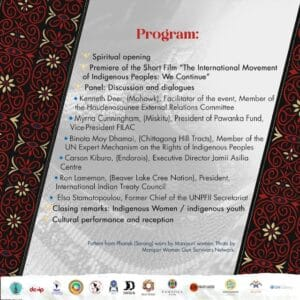

 Accompanying the event is the book launch for "Indigenous Peoples in the International Arena: The Global Movement for Self-Determination" by Elsa Stamatopoulou and the short Film "_The International Movement of Indigenous Peoples: We Continue_"

- Date: Wednesday, 23 April
- Time: 13:15 to 14:30
- Venue: Conference Room 4 - UN Headquarters- NYC X
- Interpretation: English - Spanish - Russian- French
- Free copies of the book will be distributed.
- Light Refreshments will be served

 
