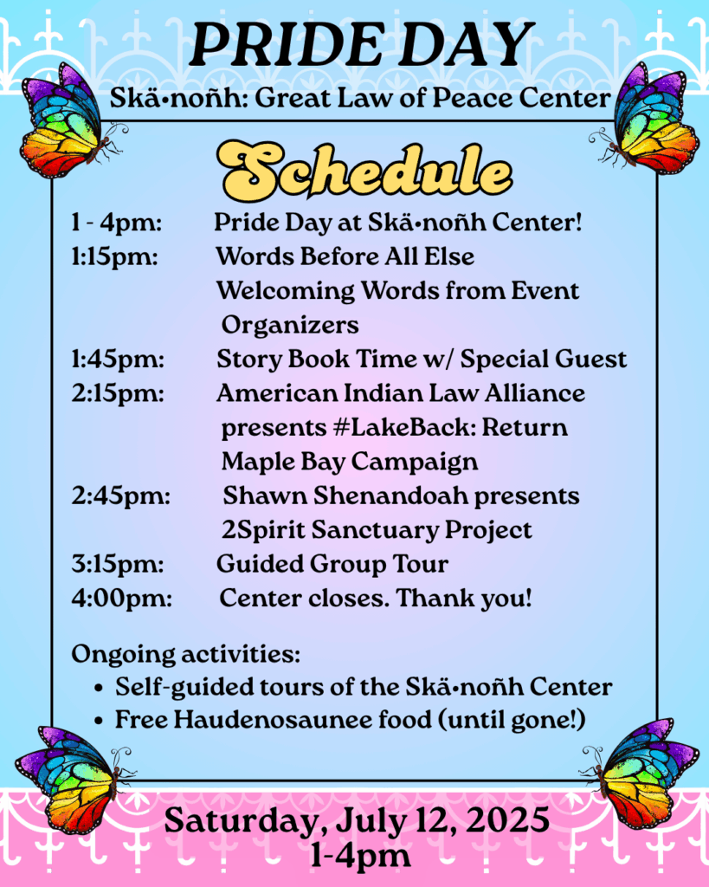

Everyone is invited to join us for **Pride Day at Skä•noñh Center, this Saturday, July 12, 2025, from 1-4pm.** More details and RSVP at: [**tinyurl.com/PrideDayRSVP**](http://tinyurl.com/PrideDayRSVP). 

Skä•noñh Center is located at 6680 Onondaga Lake Pkwy, Liverpool, NY. Admission to Skä•noñh Center is $5; kids 5 and under FREE. If cost is a barrier, free admission is available upon request.

 

There will be brief presentations from the American Indian Law Alliance discussing the #LakeBack: Return Maple Bay Campaign. As well as Shawn Shenandoah (Onondaga Nation) presenting the 2Spirit Sanctuary Project.

 

We are honored to serve traditional Haudenosaunee food, provided by Tina Thomas (Onondaga Nation, Eel Clan). FREE of cost to all guests. Free food will be served from 1pm until it is gone. There are vegetarian and gluten free options available and outside seating.

 

Please join us for this joyous, family friendly community event. Open to all. **We look forward to being with you on Saturday!** Remember to RSVP at: [**tinyurl.com/PrideDayRSVP**](http://tinyurl.com/PrideDayRSVP).
