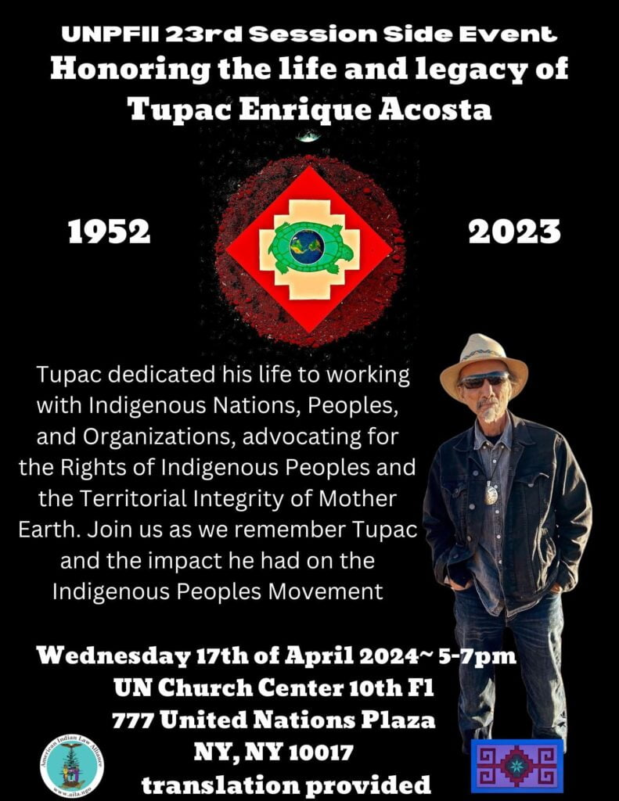
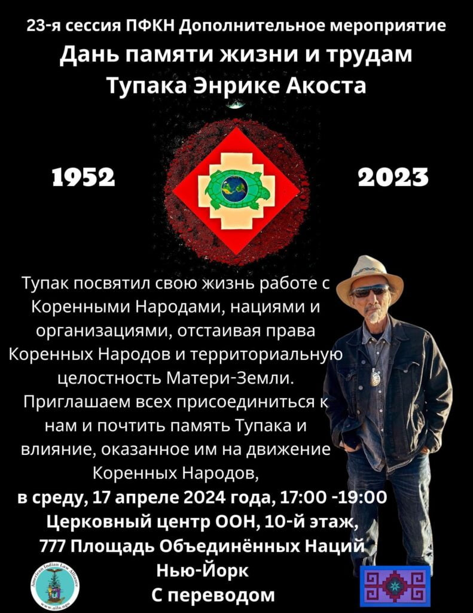

UNPFII 23rd Session Side Event Honoring the Life and Legacy of Tupac Enrique Acosta (1952-2023)

Tupac dedicated his life to working with Indigenous Nations and Peoples, and Organizations, advocating for the rights of Indigenous Peoples and the Territorial Integrity of Mother Earth. Join us as we remember Tupac and the impact he had on the Indigenous Peoples Movement.

### Event Details

- Wednesday 17th of April 2024 - 5-7PM

- UN Church Center, 10th Floor

- 777 United Nations Plaza, NYC

- English and Spanish Translation Provided

- _This event is free and open to the public_

[PDF Event Flyer](http://aila.ngo/wp-content/uploads/2024/04/tupac-enrique-acosta-event.pdf)
