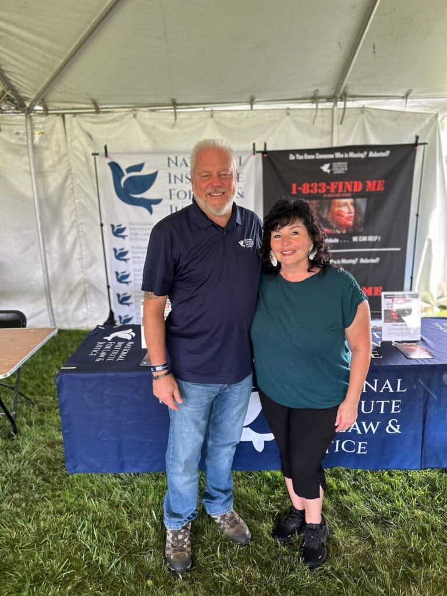

## ✏️ Recent Highlights

Thank you so much to all of our teams, vendors, and volunteers who made The Restore Our Sacred Lake 5K and Haudenosaunee Wooden Stick Festival Weekend such a success. There were so many highlights, with over 2,000 people visiting on Saturday alone! Here are some of the highlights:

##  The Restore Our Sacred Lake 5K

Thank you to all the volunteers and runners who joined the Restore Our Sacred Lake 5K. We had the largest number of runners ever! The race is such an important reminder to everyone about the sacredness of the lake and the urgency of cleaning up and restoring the waters for all living beings.

## Vendors and Tablers

This year we were so excited to have Travis Gabriel and Mitchell Lacrosse vending and demonstrating how to make and repair wooden sticks.

We were honored to have over 25 arts, crafts, and educational vendors. We loved seeing all of the traditional Haudenosaunee arts and crafts there. A big Nya•weñha to our food vendors who kept everyone fed on wonderful traditional Haudenosaunee foods.

Our friends and collaborators at the [National Institute for Law & Justice (NILJ)](https://nilj.org/) tabled at the event and were there to speak with community members about the crisis of Missing and Murdered Indigenous Relatives (MMIR). If you need help with a case of a missing or murdered Indigenous relative in your family please reach out to them.

## Randy Hall Memorial Tournament

We would also like to say a big Nya•weñha to the family of Randy Hall for being at the tournament. In 2013 Randy Hall brought a leather ball to Philip P. Arnold and Sandra Bigtree of the [Indigenous Values Initiative](https://indigenousvalues.org/ "Indigenous Values Initiative") and shared with them the dream of having a wooden stick festival and tournament at Onondaga Lake. Randy passed away in 2018 and the tournament was named in his honor. It meant the world to us to have his family and friends present for the award ceremony. The teams played twenty four exciting games over the course of two days and they were amazing!

Thank you to all six teams for playing in the tournament.

1. Oneida Siverhakws (Oneida & Onondaga)
2. Mann's Wolfpack (Akwesasne)
3. WIld Turkeys (Kanesatake)
4. United Masters (Pennsylvania & NY)
5. Ohi:yó Masters (Allegany)
6. AILA Eagles (House Team)

## Smoke Dance

A big Nya•weñha to Heath Hill for helping us organize the first Smoke Dance competition to take place at the festival. The event was a huge success and we look forward to having more dancers next year.

## Speakers

 Nya•weñha also to our speakers who shared their knowledge. Oren Lyons, who talked about the Haudenosaunee teachings on the natural world and climate change, Jake Edwards, who spoke about the wampum belts and treaties, Joe Heath, who spoke about the pollution of the lake, Karena Gore, who spoke about ecology and what we can learn from nature. This event has always been about sharing the importance of The Great Law of Peace and our sacred lake — thank you for the ways you reminded us of our responsibilities to each other and our Mother Earth.

## Indigenous Values Initiative

Finally we would like to say a big Nya•weñha to our dear friends Philip P. Arnold and Sandy Bigtree of the Indigenous Values Initiative for founding this festival and for so kindly passing the torch to us for hosting the festival solo this year. We are honored to call them friends and to collaborate so closely with them on many wonderful projects. We are in the midsts of planing several wonderful events with them so please stay in touch.

## Alfie Jacques Ambassador Award

Alfie Jacques of the Onondaga Nation Turtle Clan was an incredible person, brilliant educator, hall of fame goalie, championship coach, and he is perhaps most well known for his commitment to crafting excellent traditional wooden sticks for players to use in Deyhontsigwa’ehs (They Bump Hips). His sticks are never wall art. We are all grieving his passing and he was such a wonderful ambassador for Deyhontsigwa’ehs.

The Alfie Jacques Ambassador Award was created to keep the legacy of the Onondaga Stickmaker alive, to promote the game’s sacred Indigenous roots, and to honor members of the larger community who share Alfie’s love of lacrosse and his commitment to its growth.

This being the first year of this award, it was essential to choose someone who exemplified Alfie, his teachings, and his commitment to the larger lacrosse community.  We have chosen Sid Jamieson for this distinct honor. The celebration dinner has passed but you can still contribute to [the award](https://www.alfie.fans/ "the award"). At the dinner we were pleased to learn that Native Vision of the Johns Hopkins Center for Indigenous Health has named an annual college scholarship in Alfie’s name.

