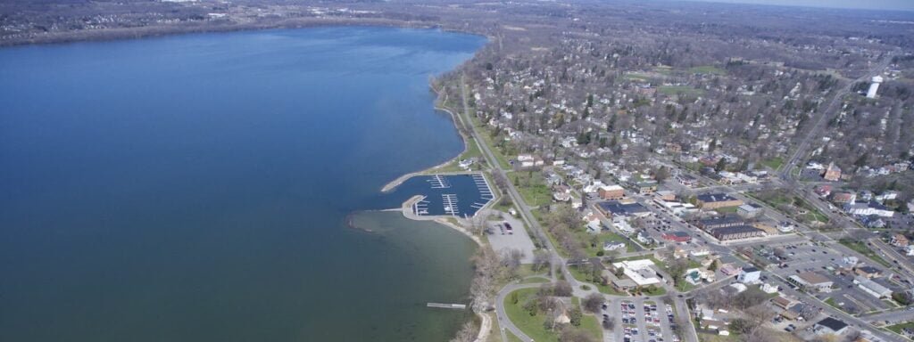

To the Editor:

In response to Onondaga County Executive Ryan McMahon’s claim that an aquarium is the “perfect use” for Onondaga Lake cleanup funds, I must strongly disagree. The most effective use of these funds is to continue the essential work of cleaning up and restoring the lake itself, rather than diverting public money into over-budget development projects, such as the Inner Harbor aquarium.  
  

[Read More](https://www.syracuse.com/opinion/2025/07/onondaga-lake-restoration-is-far-from-finished-your-letters.html)
